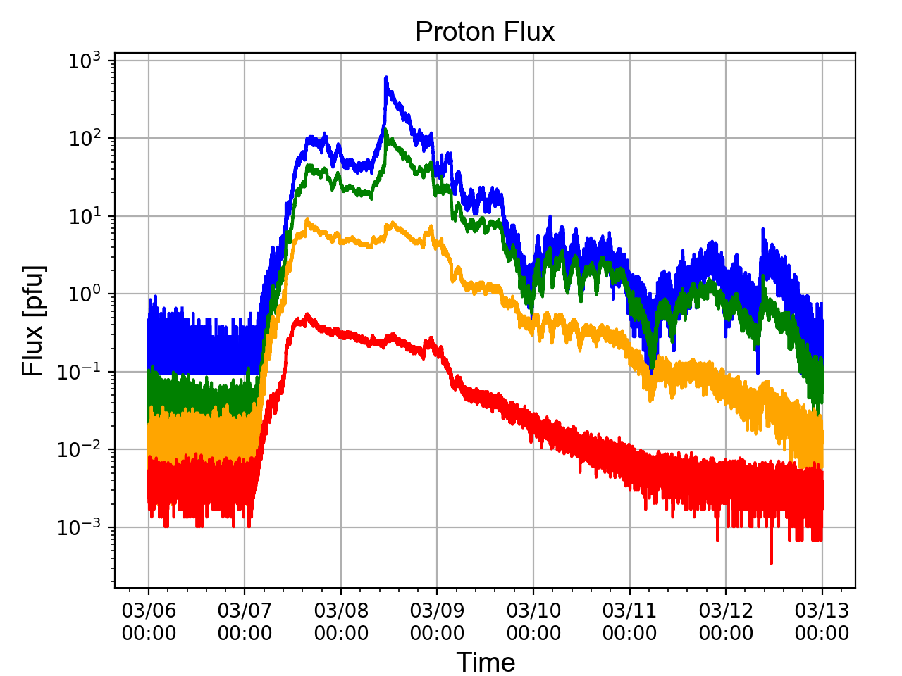

# ICS110 Individual Project

Analytical Question
=========================
-Is the maximum proton flux at Earth correlated to the intensity of solar flares on the Sun?

-Are properties of interplanetary space, such as solar wind speed or temperature, indicators of maximum proton flux at Earth?

-What are the statistical deviations from the background during intense solar events?

Evaluate and/or Investigate your Data
=========================
The python script is 'read_data.py'

The script currently reads in GOES-15 proton flux (.csv), GOES-15 Xray flux (.csv), and Neutron monitor data (.txt).

Sample displayed data of pandas data frame of xray flux:

                    xrdate     xrflux1     xrflux2
0  2012-03-06 00:04:57.250  2.0555E-07  2.4972E-06

Data
=========================
The data consists of mainly flux data from instruments on the ground, Earth orbit, and at the L1 Lagrange point. The data includes a sample from (2012 March), not normalized, and complete in intervals of about 30 seconds to a minute. Data values that were not accepted are denoted at extreme negative values around -9999. The specifics of each data set is commented in each header.

GOES-13 Proton Flux

GOES-15 Xray Flux

ACE Magnetic Field Components

ACE Solar Wind Parameters

OULU Neutron Monitor Data

#